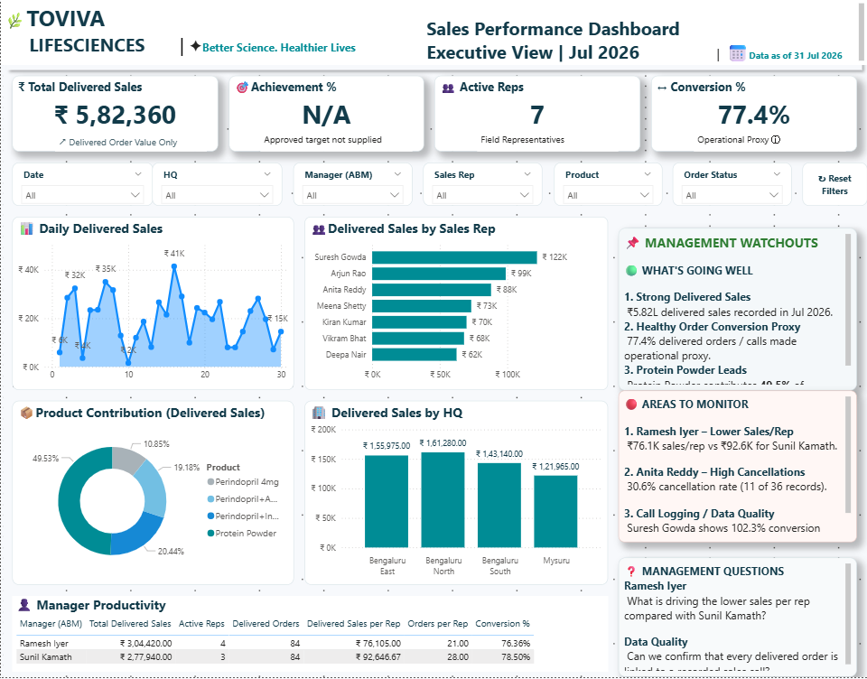

# Toviva-Sales-MIS-PowerBI
Pharmaceutical Sales MIS and Power BI Dashboard project using Excel, Power Query and DAX.

# Pharmaceutical Sales MIS & Power BI Dashboard

A Business Analyst case study focused on cleaning, validating, analysing, and visualising pharmaceutical sales data using Excel and Power BI.

> **Note:** This is a portfolio/assessment case study created for demonstrating data analytics and Business Analyst skills. The project is not presented as employment or client work.

---

## 📊 Dashboard Preview

---

## 🎯 Project Objective

The objective of this project was to transform raw pharmaceutical sales data into a reliable MIS and Power BI dashboard that can help management understand:

- Sales performance
- Sales representative performance
- Product contribution
- Manager/team performance
- Data quality issues
- Order and conversion-related metrics

---

## 🛠️ Tools & Technologies

- **Microsoft Excel**
- **Power Query**
- **Power BI**
- **DAX**
- Data Cleaning & Validation
- MIS Reporting
- Business Analysis

---

## 🧹 Data Cleaning & Quality Checks

The raw dataset was reviewed and cleaned before analysis.

Key activities included:

- Removed exact duplicate records
- Identified missing Units Sold
- Identified missing PTR
- Identified missing Order Value
- Standardised doctor names
- Converted mixed date formats into valid Excel dates
- Recalculated Order Value where Units Sold and PTR were available
- Identified Order Value mismatches
- Created a Data Quality Check sheet
- Maintained a Cleaning Log for auditability

### Data Quality Findings

- **308** raw records
- **8** exact duplicate records identified
- **300** records retained after duplicate removal
- Missing Units Sold and PTR records were flagged rather than estimated
- Order Value mismatches were identified and investigated
- Doctor-name variations were standardised for consistent analysis

---

## 📈 Business Analysis

The analysis focused on:

- Total sales
- Delivered sales
- Sales representative performance
- Manager/team performance
- Product contribution
- Order-level analysis
- Conversion-related analysis
- Data-quality trends

The analysis was designed to help identify performance gaps and areas requiring further investigation.

---

## 📊 Power BI Dashboard

The Power BI dashboard includes:

- KPI cards
- Sales performance analysis
- Revenue by product/category
- Revenue by region
- Monthly sales trend
- Representative-level analysis
- Interactive slicers
- Drill-down analysis
- DAX-based calculations

---

## 💡 Key Business Insights

Some of the key observations from the analysis included:

- Delivered sales were analysed separately from all-status order values.
- Protein Powder represented the largest product contribution among the analysed products.
- Differences in representative/team performance were investigated through delivered orders and conversion-related metrics.
- Data-quality issues such as duplicate records, missing values and Order Value mismatches can directly affect management reporting.
- Conversion was treated as a proxy because the dataset did not provide a direct Call ID-to-Order ID relationship.

---

## 📁 Project Files

| File | Description |
|---|---|
| `Samuvel_Toviva_Sales_MIS.xlsx` | Excel workbook containing data cleaning, quality checks and analysis |
| `Samuvel_Toviva_Lifesciences_PowerBi Dashborad.pbix` | Power BI dashboard |
| `Dashboard.png` | Dashboard preview |

---

## 🔍 Skills Demonstrated

### Excel
- Data cleaning
- Pivot Tables
- Data validation
- Conditional logic
- Excel formulas
- MIS reporting

### Power BI
- Data modelling
- Power Query
- DAX
- KPI development
- Interactive dashboards
- Slicers and drill-through analysis

### Business Analysis
- Data-quality investigation
- KPI analysis
- Performance analysis
- Identifying business issues
- Converting data into management insights

---

## 🚀 Learning Outcome

This project helped strengthen my practical understanding of the complete analytics workflow:

**Raw Data → Data Cleaning → Data Validation → Analysis → Power BI → Business Insights**

---

## 👤 Author

**Samuvel M**

Aspiring Data Analyst / Business Analyst

Skills: Excel | SQL | Power BI | DAX | Python
